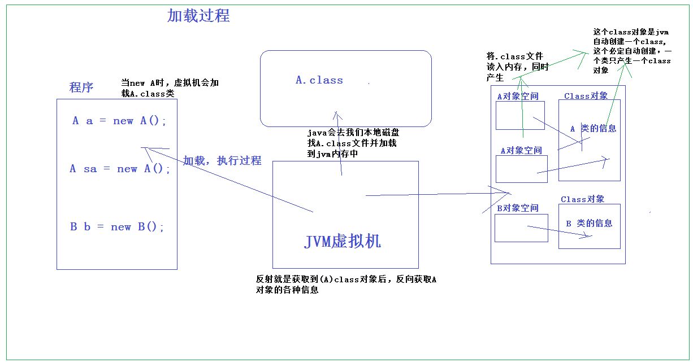

#### 反射的概念
反射是Java的特征之一，是一种间接操作目标对象的机制，核心是JVM在运行状态的时候才动态加载类，对于任意一个类都能够知道这个类所有的属性和方法，并且对于任意一个对象，都能够调用它的方法/访问属性。这种动态获取信息以及动态调用对象方法的功能成为Java语言的反射机制。通过使用反射我们不仅可以获取到任何类的成员方法(Methods)、成员变量(Fields)、构造方法(Constructors)等信息，还可以动态创建Java类实例、调用任意的类方法、修改任意的类成员变量值等。

java反射机制组成需要重点注意以下的类：

`java.lang.Class`：类对象;
`java.lang.reflect.Constructor`：类的构造器对象;
`java.lang.reflect.Field`：类的属性对象;
`java.lang.reflect.Method`：类的方法对象;

#### 加载过程

<a href="https://www.liaoxuefeng.com/wiki/1252599548343744/1264799402020448">这里可以看廖雪峰的网站的该部分</a>

#### 获取class的几种方法
```java
方法一：直接通过一个class的静态变量class获取：
Class cls = String.class;

方法二：如果我们有一个实例变量，可以通过该实例变量提供的getClass()方法获取：
String s = "Hello";
Class cls = s.getClass();

方法三：如果知道一个class的完整类名，可以通过静态方法Class.forName()获取：
Class cls = Class.forName("java.lang.String");
```

#### 通过Class对象获取到该类的构造器
* `getDeclaredConstructors()`:返回 Constructor 对象的一个数组，这些对象反映此 Class 对象表示的类声明的所有构造方法</br>
* `getConstructors()`:返回一个包含某些 Constructor 对象的数组，这些对象反映此 Class 对象所表示的类的所有公共（public）构造方法。</br>
* `getConstructor(Class<?>... parameterTypes)`:
返回一个 Constructor 对象，它反映此 Class 对象所表示的类的指定公共（public）构造方法</br>
* `getDeclaredConstructor(Class<?>... parameterTypes`:返回一个 Constructor 对象，该对象反映此 Class 对象所表示的类或接口的指定构造方法

演示实例：
```java
import java.lang.reflect.Constructor;

public class Student {

    //通过多个构造器不同的修饰符  不同的形参列表

    Student(String name) {
        System.out.println("用default修饰的Student的含有一个String参数的构造器:" + name);
    }

    public Student() {
        System.out.println("用public修饰的Student的无参构造器");
    }

    public Student(String name, int age) {
        System.out.println("用public修饰的Student的含有两个参数的构造器:" + name + age);
    }

    public Student(boolean sex) {
        System.out.println("用public修饰的Student的含有一个参数的构造器:" + sex);
    }

    protected Student(int age) {
        System.out.println("用protected修饰的Student的含有一个参数的构造器:" + age);
    }

    private Student(String name, int age, boolean sex) {
        System.out.println("用private修饰的Student的含有三个参数的构造器:" + name + age + sex);
    }
}
```
1. `getDeclaredConstructors()`
```java
Class stuClass = Student.class;
    Constructor[] conArray01 = stuClass.getDeclaredConstructors();
    for (Constructor constructor : conArray01) {
        System.out.println(constructor);
    }
```
结果:
```java
private Student(java.lang.String,int,boolean)
protected Student(int)
public Student(boolean)
Student(java.lang.String)
public Student()
public Student(java.lang.String,int)
```
2. `getConstrucyors()`
```java
Constructor[] consArray02 = stuClass.getConstructors();
    for (Constructor constructor : consArray02) {
        System.out.println(constructor);
    }
```
结果:
```java
public Student(boolean)
public Student()
public Student(java.lang.String,int)
```

3. `getConstructor(null)`:
```java
Constructor con0 = stuClass.getConstructor(null);  //无参的  无参构造器参数就是null或者空，等同于stuClass.getConstructor()
Constructor con = stuClass.getConstructor(boolean.class);  //boolean的
System.out.println(con0);
System.out.println(con);
```
结果:
```java
public Student()
public Student(boolean)
```

4. `getDeclaredConstructor(Class<?>... parameterTypes)`:
```java
Constructor con1 = stuClass.getDeclaredConstructor(int.class);
    System.out.println(con1);
    Constructor con2 = stuClass.getDeclaredConstructor(String.class,int.class,boolean.class);
    System.out.println(con2);
```
结果:
```java
protected Student(int)
private Student(java.lang.String,int,boolean)
```
#### 通过获取到的构造器创建对象
```java
 Class stuClass = Student.class;
         Constructor con1 = stuClass.getDeclaredConstructor(int.class);
        System.out.println(con1);
        Constructor con2 = stuClass.getDeclaredConstructor(String.class,int.class,boolean.class);
        System.out.println(con2);

        con2.setAccessible(true);
        Object Object = con2.newInstance("张三",10,true);
        Student student = (Student) Object;
```
结果:
```java
protected Student(int)
private Student(java.lang.String,int,boolean)
用private修饰的Student的含有三个参数的构造器:张三10true
```
其中 `con2.setAccessible(true)`可以访问私有变量，`newInstance`创建实例对象

#### 字段
访问字段
对任意的一个Object实例，只要我们获取了它的Class，就可以获取它的一切信息。
我们先看看如何通过Class实例获取字段信息。Class类提供了以下几个方法来获取字段：

* `Field getField(name)`：根据字段名获取某个public的field（包括父类）</br>
* `Field getDeclaredField(name)`：根据字段名获取当前类的某个field（不包括父类）</br>
* `Field[] getFields()`：获取所有public的field（包括父类）</br>
* `Field[] getDeclaredFields()`：获取当前类的所有field（不包括父类）</br>


测试类:
```java
public class Teacher {

    public Teacher() {
    }

    public String name;

    protected int age;

    boolean sex;

    private String address;

    @Override
    public String toString() {
        return "Teacher [name=" + name + ", age=" + age + ", sex=" + sex + ", address=" + address + "]";
    }
```
测试代码:
```java
public static void main(String[] args) throws ClassNotFoundException, NoSuchFieldException, NoSuchMethodException, InvocationTargetException, InstantiationException, IllegalAccessException {
        Class teaClass = Class.forName("Teacher");	//创建Class对象（第三种方式）

//获取Teacher类中的所有的public字段
        Field[] f = teaClass.getFields();
        for (Field field : f) {
            System.out.println(field);
        }

//获取Teacher类中的所有的字段(包含各种访问修饰符)
        System.out.println("===========所有的字段=======================>");
        Field[] df = teaClass.getDeclaredFields();
        for (Field field : df) {
            System.out.println(field);
        }
        System.out.println("===========公共的特定的字段=======================>");
// 获取公共的特定的字段
        Field field = teaClass.getField("name");
        System.out.println(field);
        System.out.println("===========特定的字段=======================>");
// 获取特定的字段
        Field field2 = teaClass.getDeclaredField("age");
        System.out.println(field2);

/**
 * 为字段设置具体的值
 * 参数一:该类的对象
 * 参数二:为特定的属性赋值
 */
        Object object = teaClass.getConstructor().newInstance();//相当于Object object = new Teacher();
        field.set(object, "张三丰");

        System.out.println("名称为:"+((Teacher)object).name);

    }
```
结果:
```java
public java.lang.String Teacher.name
===========所有的字段=======================>
public java.lang.String Teacher.name
protected int Teacher.age
boolean Teacher.sex
private java.lang.String Teacher.address
===========公共的特定的字段=======================>
public java.lang.String Teacher.name
===========特定的字段=======================>
protected int Teacher.age
名称为:张三丰
```

#### 通过Class对象获取到该类的方法

* `Method getMethod(name, Class...)`：获取某个public的Method（包括父类）
* `Method getDeclaredMethod(name, Class...)`：获取当前类的某个Method（不包括父类）
* `Method[] getMethods()`：获取所有public的Method（包括父类）
* `Method[] getDeclaredMethods()`：获取当前类的所有Method（不包括父类）
实例代码:
```java
public class Employee {

    public Employee() {
    }

    public String name;

    protected double money;

    String address;

    private long number;


    protected void getDayMoney(String name) {
        System.out.println("我是Employee受保护的获取日薪的方法,有一个参数为:" + name);
    }

    public void getweekMoney(String name, double money) {
        System.out.println("我是Employee公有的获取周薪的方法,没有参数..");
    }

    void getMonthMoney() {
        System.out.println("我是Employee默认的获取月薪的方法,没有参数..");
    }

    private void getYearMoney(int age) {
        System.out.println("我是Employee私有的的获年薪月薪的方法,有一个参数为:" + age);
    }

    @Override
    public String toString() {
        return "Employee [name=" + name + ", money=" + money + ", address=" + address + ", number=" + number + "]";
    }
```

测试代码；
```java
 System.out.println("Employee中的main()方法执行了...");
        System.out.println(Arrays.toString(args));

        Class<?> emplClass = Class.forName("Employee");
        System.out.println("==========================================");
        System.out.println("1.获取所有的公共的方法  （包含父类的方法）");
        Method[] methods = emplClass.getMethods();
        for (Method method : methods) {
            System.out.println(method);
        }
        System.out.println("==========================================");
        System.out.println("2.获取该类中的所有方法，以数组形式返回");
        Method[] methods1 = emplClass.getDeclaredMethods();
        for (Method method : methods1) {
            System.out.println(method);
        }
        System.out.println("==========================================");
        System.out.println("3.获取特定的公有的方法：  只能是公共的");
        //3.获取特定的公有的方法：  只能是公共的
//参数一:要获取的方法的名称,参数二:方法对应的形参列表的类型
        Method method = emplClass.getMethod("getweekMoney",new Class[]{String.class,double.class});
        System.out.println(method);     //输出：public void Employee.getweekMoney(java.lang.String,double)
        System.out.println("==========================================");
        System.out.println("//4.获取特定的方法：\t可以是私有的");
//4.获取特定的方法：	可以是私有的
        Method method2 = emplClass.getDeclaredMethod("getYearMoney", int.class);
        System.out.println(method2);	//输出：private void Employee.getYearMoney(int)
        System.out.println("==========================================");
        //emplClass对应的类的对象
        Object obj = emplClass.getConstructor().newInstance();
//可以通过Employee类对象去直接调用非私有方法，我这里将测试类和Employee类放在了同一个包下，所有可以访问默认方法（包限定方法）
        Employee employee = (Employee)obj;
        employee.getMonthMoney();

//参数一:要调用的对象 参数二:方法具体要求传递的值   返回值:为调用该方法后的返回值所对应的对象,如果没有返回值（void）,则对象为null
        method2.setAccessible(true);
        Object result = method2.invoke(obj, 20);   //执行method2方法对应的代码
        System.out.println(result);
```
结果:
```java
Employee中的main()方法执行了...
[]
==========================================
1.获取所有的公共的方法  （包含父类的方法）
public static void Employee.main(java.lang.String[]) throws java.lang.ClassNotFoundException,java.lang.NoSuchMethodException,java.lang.reflect.InvocationTargetException,java.lang.InstantiationException,java.lang.IllegalAccessException
public java.lang.String Employee.toString()
public void Employee.getweekMoney(java.lang.String,double)
public final void java.lang.Object.wait() throws java.lang.InterruptedException
public final void java.lang.Object.wait(long,int) throws java.lang.InterruptedException
public final native void java.lang.Object.wait(long) throws java.lang.InterruptedException
public boolean java.lang.Object.equals(java.lang.Object)
public native int java.lang.Object.hashCode()
public final native java.lang.Class java.lang.Object.getClass()
public final native void java.lang.Object.notify()
public final native void java.lang.Object.notifyAll()
==========================================
2.获取该类中的所有方法，以数组形式返回
public static void Employee.main(java.lang.String[]) throws java.lang.ClassNotFoundException,java.lang.NoSuchMethodException,java.lang.reflect.InvocationTargetException,java.lang.InstantiationException,java.lang.IllegalAccessException
public java.lang.String Employee.toString()
protected void Employee.getDayMoney(java.lang.String)
public void Employee.getweekMoney(java.lang.String,double)
void Employee.getMonthMoney()
private void Employee.getYearMoney(int)
==========================================
3.获取特定的公有的方法：  只能是公共的
public void Employee.getweekMoney(java.lang.String,double)
==========================================
//4.获取特定的方法：	可以是私有的
private void Employee.getYearMoney(int)
==========================================
我是Employee默认的获取月薪的方法,没有参数..
我是Employee私有的的获年薪月薪的方法,有一个参数为:20
null
```

### 参考文章</br>
https://www.cnblogs.com/ysocean/p/6516248.html
https://www.liaoxuefeng.com</br>
《java安全漫谈》</br>
https://javasec.org/javase/</br>
https://zhuanlan.zhihu.com/p/32286740</br>
https://www.cnblogs.com/yZzcXQ/p/JavaSE-reflect.html